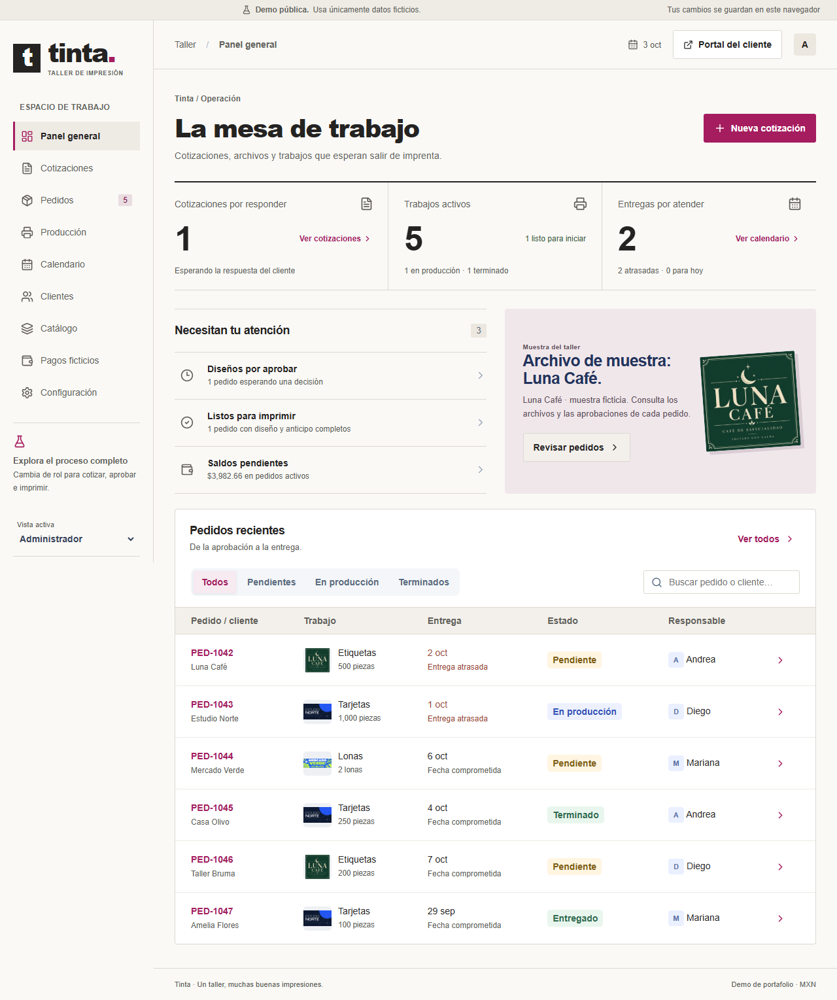
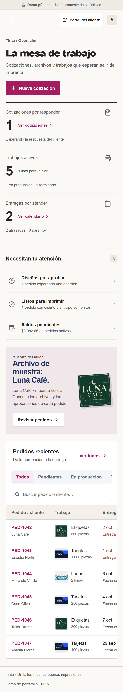

# Tinta · cotizador y producción para una imprenta

> **Proyecto de demostración con negocio ficticio.** Tinta no existe: clientes, productos, diseños, precios y pagos son datos de ejemplo.

**Demo en vivo:** https://rodyxdev.github.io/tinta-cotizador-demo/



## El problema

Una imprenta pequeña cotiza tarjetas, etiquetas y lonas por mensaje y calcula precios a mano. Las versiones de cada cotización se pierden, los diseños se aprueban "por WhatsApp" sin registro, y un trabajo puede entrar a producción sin diseño final o sin anticipo.

## La solución

Una aplicación web que lleva cada trabajo de la cotización a la entrega: calcula precios por pieza o por metro cuadrado, guarda versiones que el cliente acepta, convierte la cotización en pedido, registra la aprobación de cada diseño y no deja imprimir mientras falte el diseño o el anticipo.

## Funciones clave

- **Clientes y catálogo** configurables, con materiales y acabados compatibles.
- **Cálculo de precios** por pieza o por m², con margen sobre venta, descuento e impuesto ficticio.
- **Cotizaciones con versiones** y vigencia; el cliente las acepta o rechaza y se convierten en pedido sin duplicarse.
- **Diseños** con versiones, comentarios y aprobación por partida.
- **Producción** con bloqueos por diseño, cambios o anticipo; detención, reanudación, terminación y entrega.
- **Pagos ficticios** con reversiones trazables, calendario de entregas y panel operativo.
- **Documentos**: cotización imprimible o en PDF desde el navegador, orden de producción, comprobante de entrega y CSV.
- **Roles simulados**: administración, producción y cliente.

## Probar la demo

- Credenciales de demostración (públicas): `admin@demo.test` / `Demo123!`
- También puedes entrar con los **accesos rápidos** de la pantalla inicial: Administración, Producción o Soy cliente.
- **Los datos se guardan solo en tu navegador** (IndexedDB): prueba todo sin miedo. Nadie más ve tus cambios y no se envían a ningún servidor. En **Configuración → Restablecer demo** vuelves a los datos de ejemplo.



## Stack

- React 19, TypeScript y Vite
- Dexie sobre IndexedDB para registros e imágenes, con transacciones y migraciones
- Dinero en centavos y cálculos exactos con BigInt
- Vitest para reglas y almacenamiento; Playwright y axe para recorridos de navegador y accesibilidad
- Publicada como sitio estático en GitHub Pages

## Ejecutar localmente

Requiere Node.js 24.

```sh
npm ci
npm run dev     # muestra la dirección local; con el puerto ocupado: npm run dev -- --port 5179
npm test        # pruebas de dominio y almacenamiento
npm run build   # revisa TypeScript y genera dist/
```

No necesita variables de entorno, base de datos ni servicios externos.

Recorridos de navegador (escritorio y celular): inicia la demo en el puerto 5179 y ejecuta `npm run test:e2e`. En Windows usan Microsoft Edge instalado; en otros sistemas, instala Chromium con `npx playwright install chromium` y define `CI=1`. `DEMO_URL` permite apuntar a otro servidor. Las pruebas restablecen datos: úsalas sobre una copia de prueba.

## Publicación

- `main` contiene el código fuente.
- `gh-pages` contiene solo el build compilado que sirve GitHub Pages (Settings → Pages → Deploy from a branch → `gh-pages` → `/ (root)`).

Para publicar una actualización desde un árbol de trabajo sin cambios pendientes:

```sh
npm run build
node scripts/publish-pages.mjs
```

El script usa un índice temporal, comprueba que solo se publiquen recursos compilados y agrega a `gh-pages` un commit que referencia el commit de origen, sin reescribir su historial.

## Organización

- `src/domain/`: modelos, cálculo monetario, comandos validados y vista del portal.
- `src/storage/`: IndexedDB con Dexie, transacciones, imágenes y migraciones.
- `src/demo/`: datos de ejemplo con fechas relativas al día actual.
- `src/ui/`: pantallas y componentes.
- `src/documents/`: impresión y CSV.
- `public/designs/`: tres diseños de ejemplo para los negocios ficticios.
- `tests/`: pruebas unitarias y recorridos de navegador.

## Datos y límites

El estado y las imágenes se guardan en tablas separadas; las operaciones compuestas actualizan registros, historial e imagen en una sola transacción. Las versiones emitidas conservan conceptos, precios y reglas aunque cambie la configuración.

Valores iniciales: margen sobre venta 40 %, impuesto ficticio 16 %, descuento de 0 a 20 %, anticipo del 50 % y saldo cero para entregar. Imágenes PNG, JPEG o WebP de hasta 5 MiB y 4096 px por lado; hasta 50 imágenes y 50 MiB en total.

Es una demo: no hay autenticación real, backend, mensajes, cobros ni facturación. Los roles son una simulación de la experiencia, no una barrera de seguridad. Borrar los datos del sitio o cerrar una ventana privada elimina la información.

---

Hecho por [RodyxDev](https://rodyxdev.netlify.app).
